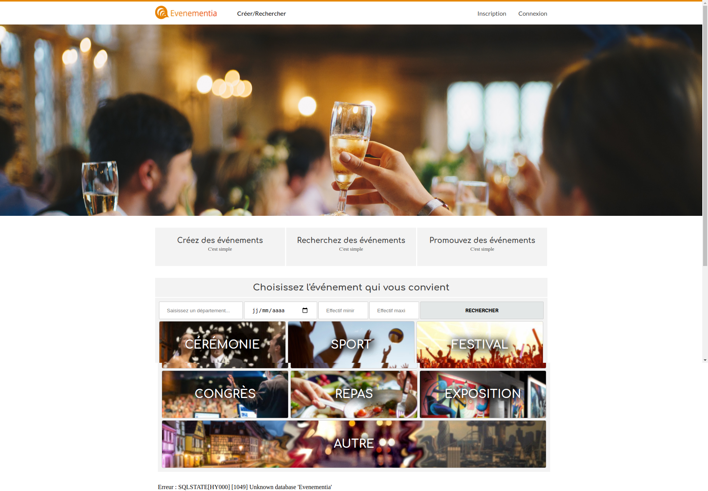

# Création d'un site web d'événements

## Screenshots

   

## Description

L'objectif de ce projet est de créer un site internet sous la forme d'une architecture LAMP et où les utilisateurs pourraient créer des événements selon différentes thématiques (cérémonie, sport, festival, repas...) en spécifiant le lieu et la date de l'événement. D'autres utilisateurs pourraient ensuite rechercher des événements en fonction de différents critères et participer aux événements qu'ils souhaitent. C'est en ce sens qu'ils pourraient indiquer qu'ils participent à l'événement directement depuis le site internet et ceci permettrait d'anticiper le nombre de participant pour un événement donné.